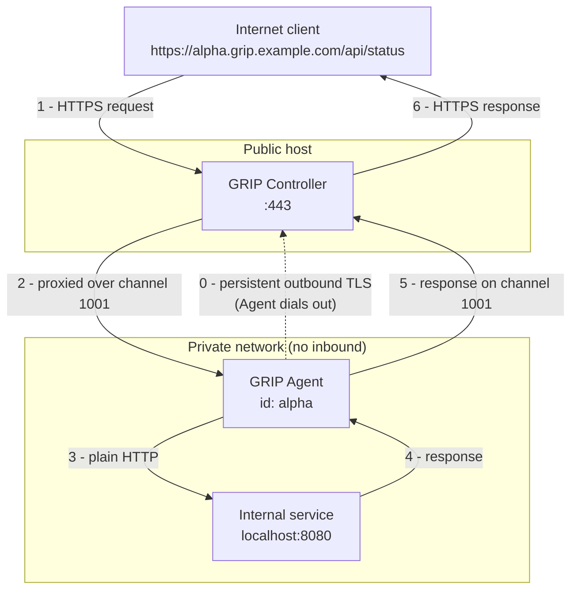

# GRIP — Generic Reverse Interconnect Proxy

GRIP gives external users secure HTTPS access to HTTP services running inside a
private network **without any inbound firewall rule, port forward, VPN, or SSH
tunnel**.

It is a pair of small Java services:

| Service | Runs | Role |
|---|---|---|
| **GRIP Controller** | on a public Internet host | Terminates external HTTPS. Accepts one long-lived connection per Agent. Routes each external request to the right Agent and proxies it over a multiplexed channel. |
| **GRIP Agent** | inside the private network | Dials **out** to the Controller and keeps the connection open. Forwards the requests it receives to one configured internal HTTP service. |

The Agent always initiates the connection. The private network never has to
accept an inbound connection.

> **Status: early scaffolding.** The repository structure, protocol vocabulary,
> and documentation are in place. Proxying is being built one issue at a time —
> see the [roadmap](docs/roadmap.md) and the GitHub issues.

## The problem

You have an HTTP service — a dev box, an appliance, an internal API — that lives
somewhere you do not control the network edge: behind CGNAT, on a corporate
LAN, inside a cloud VPC with no ingress. You want to reach it from the Internet
over a normal URL, and you do not want to (or cannot) open a port, run a VPN, or
manage SSH keys for it.

GRIP solves exactly this narrow case, and deliberately nothing more. It is a
reverse HTTP proxy whose "backend connection" happens to be dialled in the
opposite direction.

## How it works



1. The Agent opens a persistent outbound WebSocket (over TLS) to the Controller
   and registers a name (`alpha`).
2. An external client makes an ordinary HTTPS request to
   `alpha.grip.example.com`.
3. The Controller matches the sub-domain to a connected Agent, allocates a
   **channel ID**, and streams the request to the Agent over the existing
   connection.
4. The Agent makes the corresponding request to its configured internal service
   and streams the response back on the same channel.
5. The Controller writes that response to the external client.

### Sub-domain routing

The external `Host` header selects the Agent:

```
alpha.grip.example.com   ->  Agent "alpha"
beta.grip.example.com    ->  Agent "beta"
devbox.grip.example.com  ->  Agent "devbox"
```

The base domain (`grip.example.com` here) is configuration, never hard-coded.

### Multiplexed channels

One Agent connection carries many concurrent requests. Every request gets a
unique channel ID, and every frame on the connection names its channel:

```
REQUEST_START  1001
REQUEST_START  1002
RESPONSE_START 1002
RESPONSE_DATA  1002
RESPONSE_START 1001
...
```

Responses may complete in any order. There is **no** "one connection per
request".

### Streaming

Requests and responses are streamed frame by frame. GRIP never buffers a whole
request or response in memory. The framing covers request start / body / end,
response start / body / end, cancellation, heartbeat, and protocol error.

### Cancellation

If the external client disconnects mid-request, the Controller sends `CANCEL`
for that channel and the Agent aborts the corresponding internal request.

### TLS

TLS is mandatory and always verified — full CA chain validation and hostname
verification, with no "insecure" or "trust all" switch anywhere. Certificate
issuance and renewal are left to standard tooling (Let's Encrypt via a
terminating proxy or ACME client); GRIP does not manage certificates itself.

A production Controller typically uses a wildcard certificate
(`*.grip.example.com`) for the Agent-facing sub-domains plus a normal
certificate for its own hostname (`controller.grip.example.com`).

### Authentication

The first version does **not** do mutual TLS. The transport is designed so that
stronger Agent authentication (mTLS, Agent certificates, pinning, an enrolment
/ approval step, per-Agent credentials) can be added later without changing the
proxy protocol. See [security.md](docs/security.md).

## Repository layout

```
grip/
├── pom.xml                    parent (Maven multi-module, Java 21, Spring Boot)
├── grip-protocol/             shared vocabulary: frame kinds, channel id, limits
├── grip-controller/           public edge service
├── grip-agent/                private-network service
├── grip-integration-tests/    end-to-end: client → Controller → Agent → service
└── docs/                      GitHub Pages site
```

`grip-protocol` holds only what both sides must agree on. It has no dependency
on Controller or Agent code, and no wire-format implementation yet — that is
decided in [Stage 3](docs/roadmap.md).

## Build and run

Requires JDK 21+ and Maven 3.9+.

```bash
mvn verify                     # build + test everything

# run the Controller (defaults in grip-controller/src/main/resources/application.yml)
mvn -pl grip-controller spring-boot:run

# run an Agent
mvn -pl grip-agent spring-boot:run
```

Configuration keys are documented in [development.md](docs/development.md); the
essentials are `grip.base-domain` (Controller) and `grip.agent-id`,
`grip.controller-url`, `grip.target-url` (Agent).

## Documentation

| Page | |
|---|---|
| [Architecture](docs/architecture.md) | Deployment topology, connection establishment, request flow, multiplexing, cancellation, reconnection |
| [GRIP Protocol](docs/protocol.md) | What is decided, what is deliberately deferred |
| [Security](docs/security.md) | TLS, header handling, SSRF, DoS, future auth |
| [Development](docs/development.md) | Building, configuration, testing |
| [Roadmap](docs/roadmap.md) | The staged implementation plan |

## Design principles

GRIP stays small. It is a reverse HTTP proxy over a persistent outbound
connection with multiplexed channels — nothing more.

It is **not** a VPN. There are no virtual interfaces, no IP routing, no message
broker, no database, and no inbound connectivity to the Agent. The Agent's one
connection is a WebSocket over TLS (chosen because the JDK HTTP client cannot
hold a request and response open simultaneously — see the
[protocol page](docs/protocol.md)). The framing is kept generic enough to
carry other application protocols later, but the initial implementation is
optimised for HTTP proxying.

It is also **not** a way to get around network security. GRIP is a tunnel and
makes no attempt to hide that — a TLS-inspecting firewall will identify it as
one. Run it only where you are authorised to expose the internal service. See
[Detectability and acceptable use](docs/security.md#detectability-and-acceptable-use).

## License

Apache-2.0. See [LICENSE](LICENSE).
