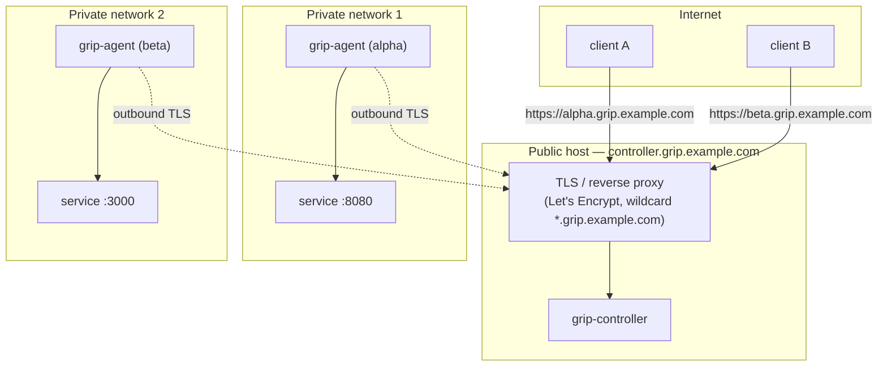
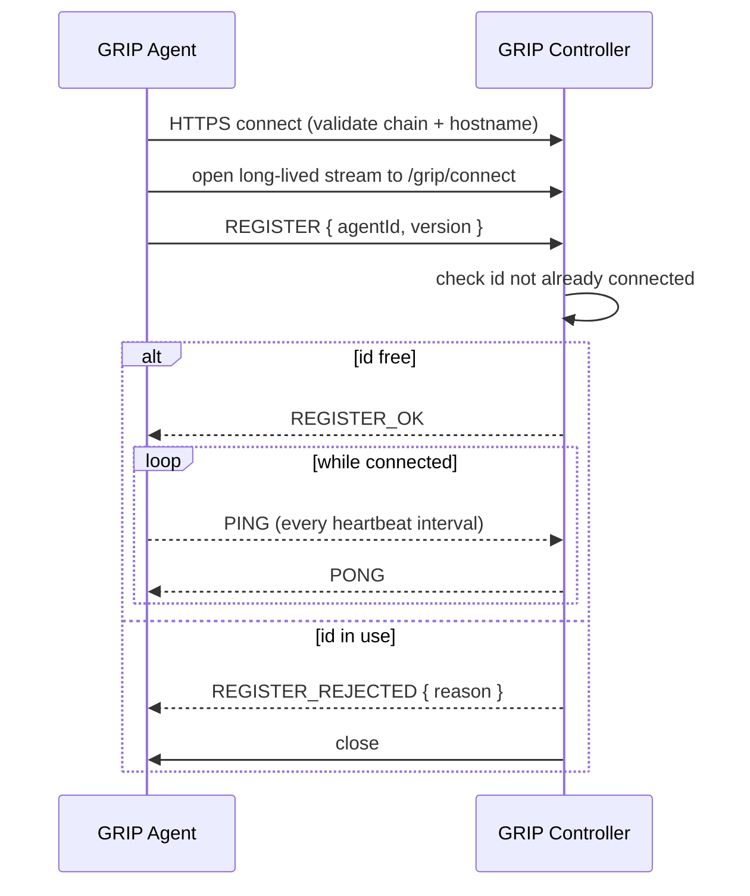
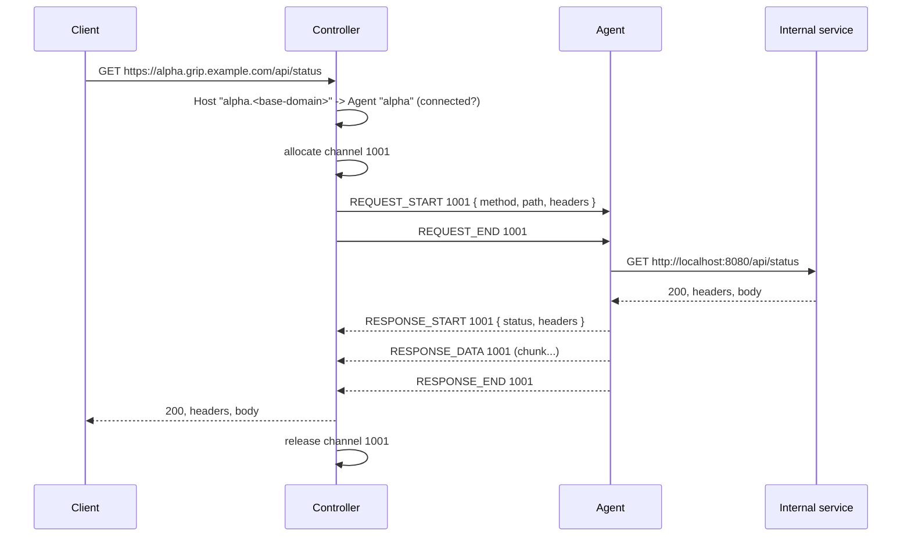
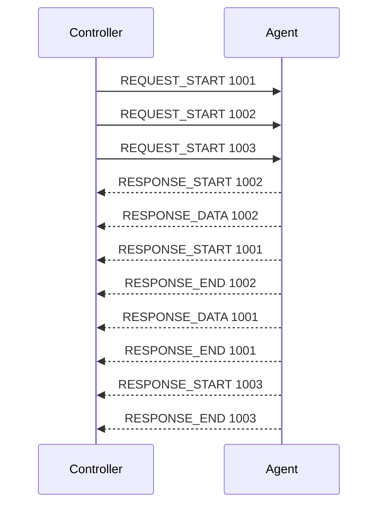
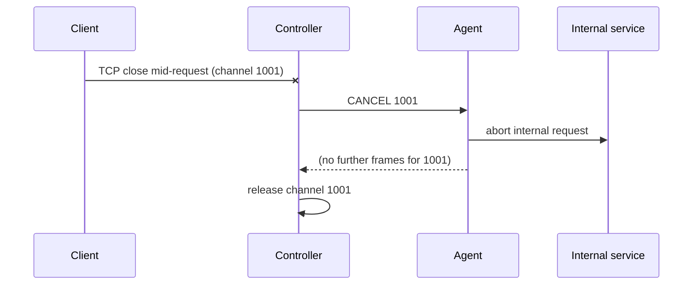
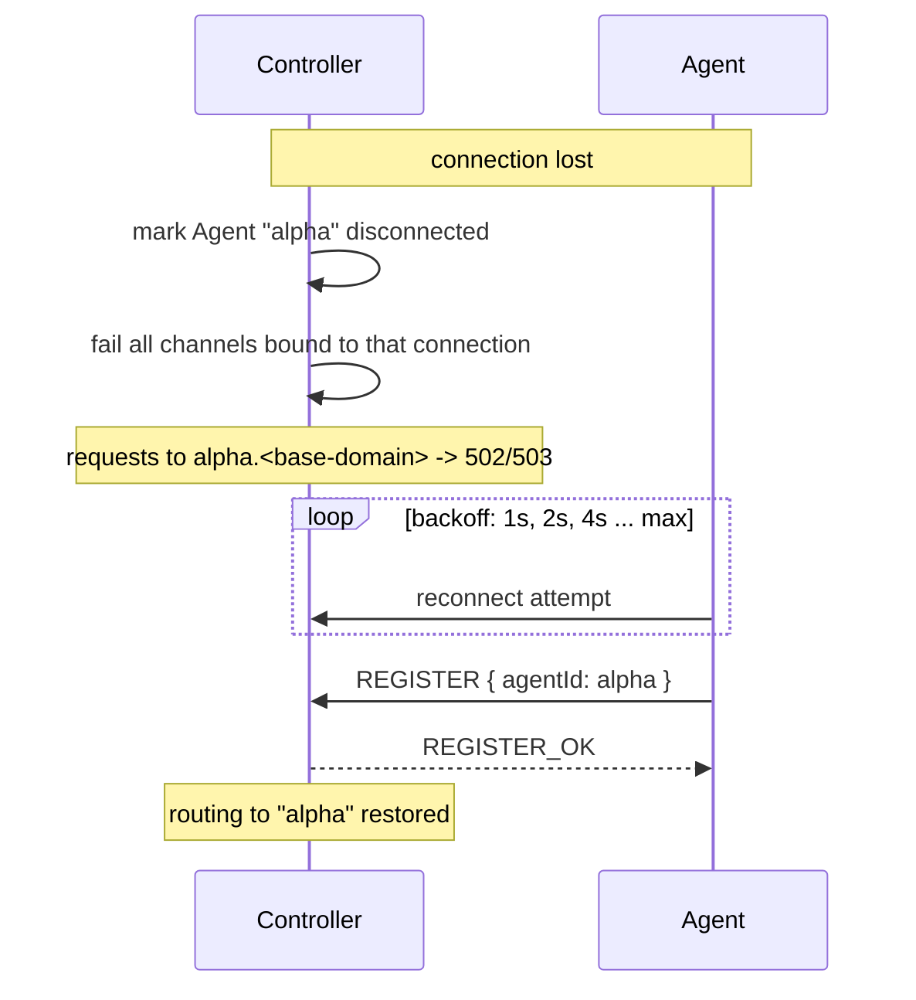

# Architecture

GRIP has two runtime components and one shared library.

| Component | Package | Responsibility |
|---|---|---|
| `grip-controller` | `dev.grip.controller` | Public edge. External HTTPS termination, Agent connection registry, sub-domain routing, channel bookkeeping, proxying. |
| `grip-agent` | `dev.grip.agent` | Private side. Outbound connection to the Controller, request forwarding to one internal service, reconnection. |
| `grip-protocol` | `dev.grip.protocol` | Shared vocabulary only — frame kinds, channel identity, limits. No transport code, no Controller/Agent types. |

## 1. Deployment topology

- The Controller is the only component reachable from the Internet.
- TLS termination and certificate management may sit in a reverse proxy in
  front of the Controller, or in the Controller itself. GRIP does not issue or
  renew certificates.
- Each private network runs one Agent per exposed service. Agents need only
  outbound HTTPS to the Controller (normally port 443).

## 2. Agent connection establishment

- The connection is **outbound from the Agent**. The Controller never dials the
  Agent.
- If the connection drops, the Agent reconnects with exponential backoff
  (`initial-backoff` → `max-backoff`).
- Missing heartbeats let either side detect a dead peer before TCP would.
- The exact REGISTER/heartbeat frames are a protocol detail fixed in Stage 3;
  the *lifecycle* above is decided.

## 3. External HTTP request flow

The Controller keeps `channel id → external request/response`; the Agent keeps
`channel id → internal request/response`. Nothing is buffered end to end.

## 4. Multiplexed concurrent requests

One Agent connection, many channels:

- Channel IDs are allocated by the Controller, unique per connection, and
  reclaimable after close.
- Responses may start and finish in any order.
- Each channel is handled on its own virtual thread on both sides; the shared
  connection is written under a single lock (or a small write queue).

## 5. Client cancellation

Cancellation also flows the other way: if the internal service fails or the
Agent shuts down, the Agent sends `CANCEL`/`ERROR` for its open channels and the
Controller ends the matching external responses.

## 6. Agent disconnection and reconnection

While an Agent is disconnected, requests for its sub-domain get a clear gateway
error rather than hanging. In-flight channels for a lost connection are failed
immediately and cleanly — no leaked state.

## Concurrency model

- Request handling uses **virtual threads**. A blocked internal call or a slow
  client costs a virtual thread, not a platform thread.
- The single GRIP connection per Agent is the one point of contention;
  writes to it are serialised.
- Synchronization is explicit and local (a registry map, a per-connection write
  path, per-channel state). No reactive pipeline unless streaming/backpressure
  work later proves it necessary.
