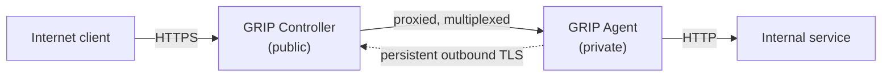

# GRIP — Generic Reverse Interconnect Proxy

GRIP gives external users secure HTTPS access to HTTP services running inside a
private network **without any inbound firewall rule, port forward, VPN, or SSH
tunnel**.

It is two small Java services:

- **GRIP Controller** — runs on a public host, terminates external HTTPS, and
  accepts one long-lived connection per Agent.
- **GRIP Agent** — runs inside the private network, dials **out** to the
  Controller, and forwards requests to one configured internal HTTP service.

The Agent always initiates the connection, so the private network never accepts
anything inbound.

## What GRIP is

A reverse HTTP proxy whose backend connection is dialled in the opposite
direction. External requests to `alpha.grip.example.com` are routed by
sub-domain to the Agent that registered as `alpha`, streamed to it over an
already-open connection on a dedicated channel, and the response is streamed
back.

## What GRIP is not

Not a VPN. No virtual network interfaces, no IP routing, no message broker, no
database, no mandatory WebSockets, and no inbound connectivity to the Agent.

## Project status

Early scaffolding. Repository structure, protocol vocabulary, and documentation
exist; proxying is being implemented one issue at a time. See the
[roadmap](roadmap.md).

## Read next

- [Architecture](architecture.md) — topology and the main flows, with diagrams
- [GRIP Protocol](protocol.md) — decided vs. deferred
- [Security](security.md) — TLS, header handling, threats, future auth
- [Development](development.md) — build, configure, test
- [Roadmap](roadmap.md) — the staged plan
