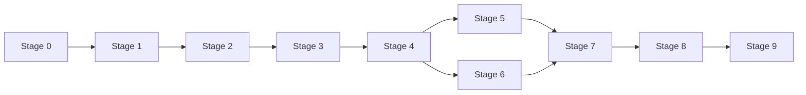

# Roadmap

GRIP is built in small, ordered stages. Each stage leaves the repository in a
working, tested state. The detailed backlog is the set of
[GitHub issues](https://github.com/johnjoeallen/grip/issues); this page is the
map.

| Stage | Goal | State |
|---|---|---|
| **0 — Foundation** | Maven multi-module skeleton, Controller/Agent/protocol modules that boot, CI, docs site | skeleton committed; CI & Pages issues open |
| **1 — Agent connection** | Agent dials out over TLS, registers, heartbeats, reconnects with backoff | planned |
| **2 — Single proxied request** | One request end to end: client → Controller → Agent → internal service → back. May allow only one active request. | planned |
| **3 — Framing protocol** | An explicit GRIP frame format and codec; `CANCEL` and `ERROR` wired through | planned |
| **4 — Multiplexing** | Many requests over one Agent connection; `channel → context` on both sides; out-of-order responses | planned |
| **5 — Streaming & backpressure** | Bodies streamed not buffered; frame/header/channel/queue limits; slow-client safety | planned |
| **6 — Host routing** | Configurable `{agent}.<base-domain>` routing; unknown/disconnected/invalid/reserved handling | planned |
| **7 — Failure handling** | Every disconnect and timeout path tested; clean channel teardown; graceful shutdown | planned |
| **8 — Security hardening** | TLS review, header forwarding, hop-by-hop stripping, limits, SSRF, DoS | planned |
| **9 — Production packaging** | Executable jars, config examples, systemd/Docker, deployment guides, Let's Encrypt example | planned |

## Implementation sequence

The dependency chain is essentially linear, with a little parallelism:

- **Stage 2 deliberately cuts a corner**: it may permit only one active request
  at a time if that makes the first working end-to-end path much simpler.
  Stage 4 removes that restriction.
- **Stage 3 comes before multiplexing** so channels ride on a real frame
  format rather than a throwaway one.
- **Stages 6 and 7** can be worked in parallel once Stage 4 and 5 land.
- **Stage 8** is a review-and-harden pass, not new features. **Stage 9** is
  packaging and docs.

## Out of scope (for now)

- Mutual TLS / Agent certificates (designed for; see [security](security.md)).
- Multiple internal services behind one Agent.
- Any non-HTTP payload, though the protocol is kept generic enough to allow it
  later.
- Certificate issuance/renewal inside GRIP.
